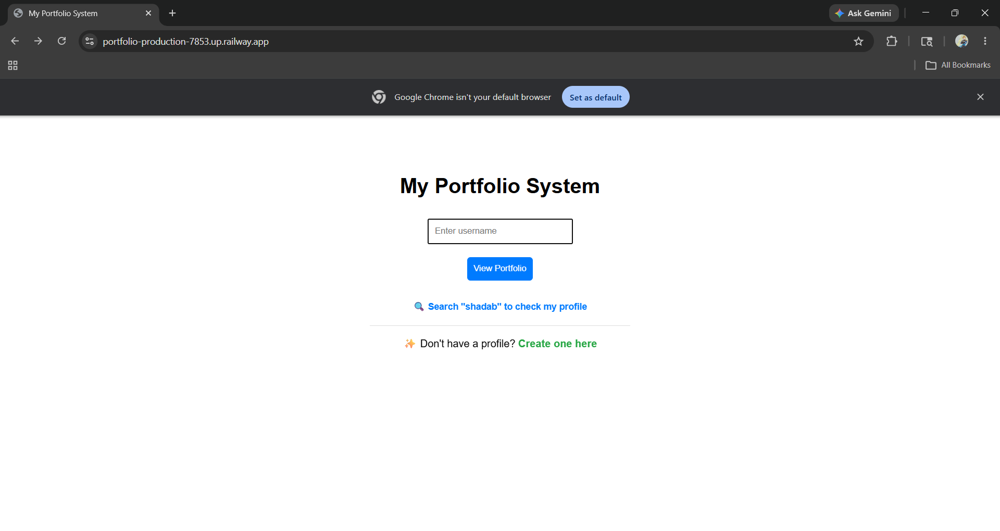
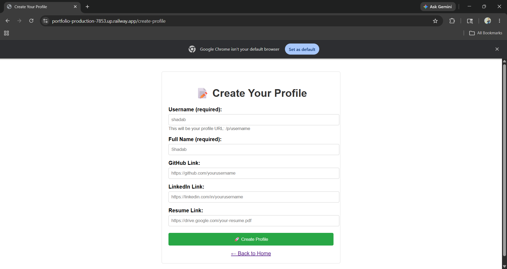
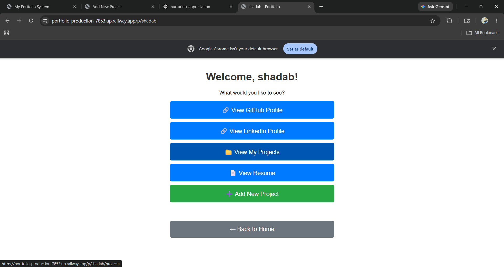
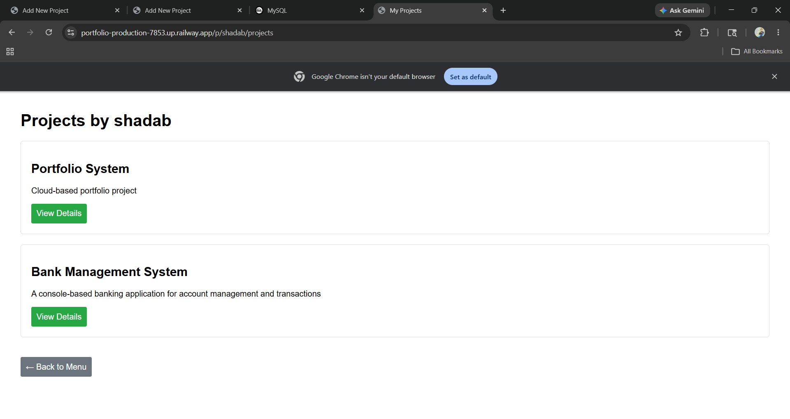
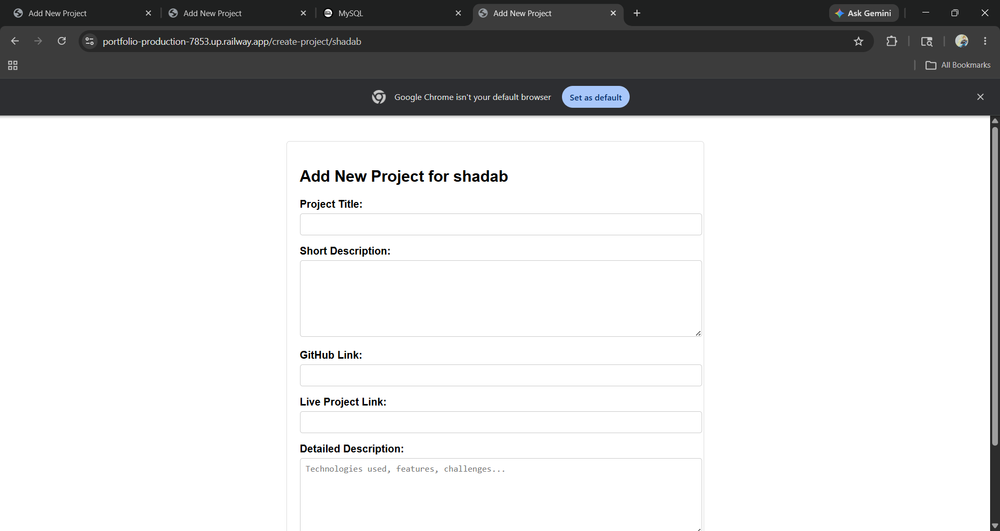

# 🚀 Portfolio Management System

<div align="center">


### A Full-Stack Portfolio System with Dynamic Profile Pages

[](https://portfolio-production-7853.up.railway.app/)
[](https://github.com/king13692468/portfolio)

</div>

---

## 📋 Table of Contents
- [Overview](#-overview)
- [Features](#-features)
- [Tech Stack](#-tech-stack)
- [Live Demo](#-live-demo)
- [Screenshots](#-screenshots)
- [Getting Started](#-getting-started)
- [Project Structure](#-project-structure)
- [API Endpoints](#-api-endpoints)
- [Database Schema](#-database-schema)
- [Deployment](#-deployment)
- [Future Enhancements](#-future-enhancements)
- [Author](#-author)

---

## 📖 Overview

The **Portfolio Management System** is a full-stack web application that allows users to create and manage their professional portfolios. Users can showcase their projects, link their GitHub and LinkedIn profiles, and share their resumes—all through a clean, user-friendly interface.

This project demonstrates proficiency in **Spring Boot**, **Spring Data JPA**, **MySQL**, and **Thymeleaf**, following industry best practices for MVC architecture and RESTful design.

---

## ✨ Features

### 👤 User Features
| Feature | Description |
|---------|-------------|
| 🔍 **Search Profiles** | Search for any user by username |
| 📝 **Create Profile** | Register with username, name, and social links |
| 👀 **View Portfolio** | Dynamic profile pages at `/p/{username}` |
| 🔗 **External Links** | Direct links to GitHub, LinkedIn, and Resume |
| 📁 **Browse Projects** | View all projects by a user |

### 📁 Project Features
| Feature | Description |
|---------|-------------|
| ➕ **Add Projects** | Users can add projects to their portfolio |
| 📖 **Project Details** | View detailed information about each project |
| 🔗 **Project Links** | GitHub repository and live demo links |

### 🛠️ Technical Features
- ✅ **RESTful API Design** - Clean and consistent endpoint naming
- ✅ **MVC Architecture** - Separation of concerns (Controller-Service-Repository)
- ✅ **Cloud Database** - MySQL hosted on Railway
- ✅ **Dynamic Routing** - Username-based profile pages
- ✅ **Responsive Design** - Works on desktop and mobile devices

---

## 🛠️ Tech Stack

<div align="center">

| Category | Technology | Version |
|----------|------------|---------|
| **Language** | Java | 17 |
| **Framework** | Spring Boot | 3.1.0 |
| **ORM** | Spring Data JPA (Hibernate) | - |
| **Database** | MySQL | 8.0 |
| **Template Engine** | Thymeleaf | 3.1.0 |
| **Build Tool** | Maven | - |
| **Cloud Platform** | Railway | - |
| **Version Control** | Git & GitHub | - |

</div>

---

## 🌐 Live Demo

The application is deployed and accessible online:

<div align="center">

### 🔗 [https://portfolio-production-7853.up.railway.app/](https://portfolio-production-7853.up.railway.app/)

**Try these demo usernames:**
- `shadab` - Main portfolio
- Create your own profile!

</div>

---

## 📸 Screenshots

<div align="center">

### Home Page


### Create Profile Form


### Profile Menu


### Projects List


### Add Project Form


</div>

## 🚀 Getting Started

### Prerequisites

- Java 17 or higher
- MySQL 8.0 or higher
- Maven 3.8+
- Git

### Installation

1. **Clone the repository**
   ```bash
   git clone https://github.com/king13692468/portfolio.git
   cd portfolio
2. **Configure MySQL database**
   ```bash
   CREATE DATABASE portfolio_db;
3. **Update application.properties**
   ```bash
   spring.datasource.url=jdbc:mysql://localhost:3306/portfolio_db
   spring.datasource.username=your_username
   spring.datasource.password=your_password
   spring.jpa.hibernate.ddl-auto=update
   spring.jpa.show-sql=true
   spring.jpa.properties.hibernate.dialect=org.hibernate.dialect.MySQL8Dialect
4. **Build and run the application**
   ```bash
   mvn clean install
   mvn spring-boot:run
5. **Access the application**
   ```bash
   http://localhost:8080
## 📁 Project Structure

```
portfolio/
├── src/
│   ├── main/
│   │   ├── java/
│   │   │   └── com/example/portfolio/
│   │   │       ├── controller/
│   │   │       │   └── ProfileController.java
│   │   │       ├── entity/
│   │   │       │   ├── User.java
│   │   │       │   └── Project.java
│   │   │       ├── repository/
│   │   │       │   ├── UserRepository.java
│   │   │       │   └── ProjectRepository.java
│   │   │       └── PortfolioApplication.java
│   │   └── resources/
│   │       ├── templates/
│   │       │   ├── index.html
│   │       │   ├── menu.html
│   │       │   ├── profile.html
│   │       │   ├── projects-list.html
│   │       │   ├── project-details.html
│   │       │   ├── resume.html
│   │       │   ├── create-profile.html
│   │       │   └── create-project.html
│   │       ├── static/
│   │       │   └── css/
│   │       │       └── style.css
│   │       └── application.properties
│   └── test/
│       └── java/
│           └── com/example/portfolio/
│               └── PortfolioApplicationTests.java
├── pom.xml
└── README.md
```
## 🔗 API Endpoints

| Method | URL | Description |
|--------|-----|-------------|
| GET | `/` | Home page |
| GET | `/p/{username}` | View user profile menu |
| GET | `/p/{username}/projects` | View user's projects |
| GET | `/p/{username}/project/{id}` | View project details |
| GET | `/p/{username}/resume` | View resume page |
| GET | `/p/{username}/redirect/github` | Redirect to GitHub profile |
| GET | `/p/{username}/redirect/linkedin` | Redirect to LinkedIn profile |
| POST | `/create-profile` | Create new user profile |
| GET | `/create-project/{username}` | Show add project form |
| POST | `/create-project` | Add new project |
| GET | `/check-users` | List all users (debug) |

## 📊 Database Schema

### User Table
```sql
CREATE TABLE user (
    id INT PRIMARY KEY AUTO_INCREMENT,
    username VARCHAR(50) UNIQUE NOT NULL,
    name VARCHAR(100) NOT NULL,
    github_link VARCHAR(255),
    linkedin_link VARCHAR(255),
    resume_link VARCHAR(255)
);
```

### Project Table
```sql
CREATE TABLE project (
    id INT PRIMARY KEY AUTO_INCREMENT,
    user_id INT NOT NULL,
    title VARCHAR(100) NOT NULL,
    description TEXT,
    github_link VARCHAR(255),
    project_link VARCHAR(255),
    details TEXT,
    FOREIGN KEY (user_id) REFERENCES user(id) ON DELETE CASCADE
);
```
## 🚀 Getting Started

### Prerequisites

- Java 17 or higher
- MySQL 8.0 or higher
- Maven 3.8+
- Git

### Installation

1. **Clone the repository**
   ```bash
   git clone https://github.com/king13692468/portfolio.git
   cd portfolio
   ```

2. **Configure MySQL database**
   ```sql
   CREATE DATABASE portfolio_db;
   ```

3. **Update `application.properties`**
   ```properties
   spring.datasource.url=jdbc:mysql://localhost:3306/portfolio_db
   spring.datasource.username=your_username
   spring.datasource.password=your_password
   spring.jpa.hibernate.ddl-auto=update
   ```

4. **Build and run**
   ```bash
   mvn clean install
   mvn spring-boot:run
   ```

5. **Access the application**
   ```
   http://localhost:8080
   ```
   ## ☁️ Deployment

### Deploy to Railway (Free)

1. **Push code to GitHub**
   ```bash
   git push origin main
   ```

2. **Connect to Railway**
   - Go to [Railway.app](https://railway.app)
   - Click "New Project" → "Deploy from GitHub"
   - Select your repository

3. **Add MySQL database**
   - Click "New" → "Database" → "MySQL"

4. **Your app is live!**
   - Railway provides a URL like `https://portfolio-production-xxxx.up.railway.app`
     
## 🔮 Future Enhancements

- [ ] User authentication (login/logout)
- [ ] Edit/Delete profile feature
- [ ] Edit/Delete projects feature
- [ ] Profile views counter
- [ ] Image upload for profile pictures
- [ ] Skill tags and technologies
- [ ] Contact form with email
- [ ] Dark mode toggle
- [ ] PDF resume upload
- [ ] Social media share buttons
- [ ] Search projects by technology
- [ ] Pagination for projects list
- [ ] Email notifications
- [ ] Export portfolio as PDF

## 👨‍💻 Author

**Shadab**

<div align="center">

[](https://github.com/king13692468)

[](https://portfolio-production-7853.up.railway.app/)

</div>

---

## ⭐ Show Your Support

If you found this project helpful, please give it a ⭐ on GitHub!

